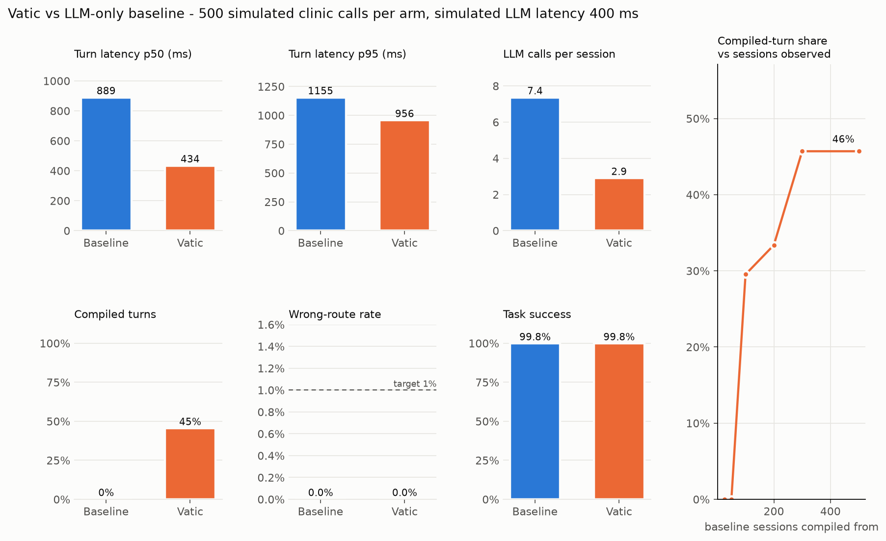

# Vatic

**Voice agents that get faster, controllable and auditable with every call.** Vatic learns
recurring call flows from real LLM-driven calls, compiles them into deterministic graphs, and
runs them with guards — falling back to your LLM whenever a call leaves the learned path.



| Metric (500 simulated clinic calls per arm, LLM latency 400 ms) | Baseline | Vatic |
|---|---:|---:|
| Turn latency p50 (ms) | 889 | 434 |
| Turn latency p95 (ms) | 1155 | 956 |
| LLM calls / session | 7.36 | 2.90 |
| Turns answered by a compiled flow | 0% | 45.5% |
| Wrong-route rate (ground truth from the simulator) | — | 0.0% |
| Task success (judged from backend state) | 99.8% | 99.8% |

Compiled turns take ~1.3 ms (p50) to decide; membership checks p95 3.1 ms; event-loop lag p99
2.5 ms. Reproduce with `python -m benchmarks.run_benchmark` (offline; see *Benchmark* below for
what is and isn't simulated).

- **The compiler is deterministic, with no LLM in it.** The same traces give byte-identical
  flows. Every tool argument has an explained binding (constant, earlier tool output, the
  caller's words via a deterministic extractor, or a registered transform), or the flow is
  refused.
- **The runtime fails toward the LLM.** Membership checks (slot extraction, residual words,
  negation/multi-intent markers, then an optional ONNX cross-encoder) decide whether an
  utterance belongs to the current step. When unsure, your LLM answers. Irreversible tools
  always sit behind a confirmation turn.
- **Flows earn their place.** candidate → shadow (computed in parallel, never calling tools) →
  active once 50 complete sessions match ≥ 98%. Flows are demoted on irreversible-step failures
  or fallback spikes. Every turn is traced.

The package is `vatic` (domain-agnostic core). **Vatic Voice** is the voice product line: the
adapters below and the reference clinic agent in `examples/`.

## Install

```bash
pip install -e .                     # core
pip install -e ".[livekit]"          # + LiveKit Agents adapter (livekit-agents==1.8.4)
pip install -e ".[pipecat]"          # + Pipecat adapter (pipecat-ai==1.12.0)
pip install -e ".[classifier]"       # + ONNX membership classifier at runtime
pip install torch transformers onnx  # only for `vatic train`
```

## How it works in one call

1. Your LLM agent handles calls as usual through `VaticRuntime`; every turn is traced.
2. `vatic compile` turns successful traces into flow graphs (YAML, with provenance).
3. `vatic promote --auto` puts valid flows in **shadow**; `vatic shadow report` shows match rate
   and wrong-route rate per step; the same command promotes them to **active** when they qualify.
4. Your LLM gets an `enter_flow` tool listing active flows. When it calls it, Vatic answers the
   following turns deterministically; off-path turns go back to the LLM with a `resume_flow` tool.

## Quickstart 1 — hand-built STT → LLM → TTS pipeline (10 min)

```python
from vatic.core.runtime import VaticRuntime
from vatic.core.tools import ToolRegistry, ToolSpec, SideEffect
from vatic.adapters.pipeline import PipelineAdapter
from vatic.trace.store import TraceStore

registry = ToolRegistry(
    [
        ToolSpec(
            name="book_appointment",
            input_schema=BookIn,
            output_schema=BookOut,
            side_effect=SideEffect.IRREVERSIBLE,
            handler=book,
        ),
        # ... every tool your agent uses, with its side-effect class
    ]
)


async def my_agent_turn(ctx):  # your existing LLM turn
    # use ctx.tools as the tool list and ctx.call_tool(name, args) to run tools;
    # stop when ctx.handed_off is True (a compiled flow took over the turn)
    ...
    return reply_text


async with VaticRuntime(registry, flows_dir="flows", store=TraceStore(".vatic/traces")) as rt:
    rt.start_session(call_id, {"today": "2026-10-05"})
    adapter = PipelineAdapter(rt, my_agent_turn)
    adapter.mark_stt_end(call_id)
    async for chunk in adapter.on_transcript(call_id, transcript):
        await tts.speak(chunk)
    adapter.mark_first_audio(call_id)
```

Try it offline with the reference clinic agent: `python -m examples.scheduling.pipeline_handbuilt`.
`examples/scheduling/agent_llm.py` shows a complete tool-calling agent written this way.

## Quickstart 2 — LiveKit Agents (10 min)

```python
from livekit.agents import AgentServer, AgentSession, JobContext
from vatic.adapters.livekit import VaticAgent

server = AgentServer()


@server.rtc_session(agent_name="clinic")
async def entrypoint(ctx: JobContext):
    agent = VaticAgent(
        runtime=runtime,
        session_id=ctx.room.name,
        session_metadata={"today": today},
        instructions=PROMPT,
    )
    session = AgentSession(stt="deepgram/nova-3", llm="openai/gpt-4.1-mini", tts="cartesia/sonic-2")
    await session.start(agent, room=ctx.room)
```

`VaticAgent` overrides `llm_node`: compiled replies go straight to TTS; otherwise LiveKit's
default LLM node and tool loop run, with every tool routed through Vatic. Full example and an
offline text demo: `examples/scheduling/pipeline_livekit.py`
(`python -m examples.scheduling.pipeline_livekit`; real rooms:
`python -m livekit.agents start examples/scheduling/pipeline_livekit.py --dev`).

## Quickstart 3 — Pipecat (10 min)

```python
from vatic.adapters.pipecat import VaticPipecat

vatic = VaticPipecat(runtime, session_id=call_id, session_metadata={"today": today})
vatic.register_functions(llm)  # domain tools + enter_flow / resume_flow
pipeline = Pipeline(
    [
        transport.input(),
        stt,
        context_pair.user(),
        vatic.input(),  # compiled turns answered here; the LLM is skipped
        llm,
        vatic.output(),  # closes LLM turns for tracing
        tts,
        transport.output(),
        context_pair.assistant(),
    ]
)
```

Offline text demo: `python -m examples.scheduling.pipeline_pipecat`.

## CLI

```
vatic traces stats                          counts, sessions, success rate
vatic compile --min-support 20 --out flows/ accepted / refused (with reasons) / skipped flows
vatic flows list | show <id> | diff <id> <v1> <v2>
vatic train [<flow>]                        per-step ONNX cross-encoders (needs torch)
vatic shadow report                         match rate, wrong-route per flow
vatic calibrate --alpha 0.01                conformal thresholds from shadow outcomes
vatic promote <id> | --auto                 lifecycle transitions (logged with evidence)
vatic demote <id>
vatic metrics [--sessions PREFIX] [--json]  latency, coverage, fallback reasons
```

Paths default to `.vatic/traces` and `flows` (override with `--store`, `--flows`, or
`VATIC_STORE` / `VATIC_FLOWS`).

## Benchmark

```bash
python -m benchmarks.run_benchmark --out benchmarks/results
```

It runs 500 LLM-only calls, compiles them, trains classifiers, runs 1000 shadow calls,
calibrates, promotes, then runs 500 calls with Vatic. It also measures compiled-turn share
against the number of sessions observed. The command exits non-zero if membership p95 exceeds
30 ms, event-loop lag p99 exceeds 5 ms, or the wrong-route rate is above target.

What is simulated, honestly:

- **The LLM** is an offline, deterministic tool-calling policy (`ScriptedClinicLLM`) with
  400 ms ± 200 ms of simulated latency. That way the benchmark runs without API keys and is
  reproducible. Set `OPENAI_API_KEY` and use `--agent llm` in `examples.simulator.run` to drive a
  real model.
- **Callers** are scripted personas (terse, chatty, confused, interrupting) with seeded
  text-level ASR noise. Task success is judged from the mock backend's state, never by an LLM.
- **Wrong-route rate** is measured against the simulator's ground-truth labels (digressions,
  corrections, multi-intent). On this data the rules layers already reject every labelled
  off-path turn. The calibrated classifier (achieved held-out wrong-route 0% against a 1%
  target) adds no extra filtering here; it is defence in depth for language the rules miss.

## Development

```bash
pip install -e ".[dev,bench,livekit,pipecat,classifier]" torch transformers onnx
pytest                      # asyncio debug mode; slow callbacks (>5 ms) fail the test
ruff check . && mypy        # mypy --strict on core, compiler, ir, trace
```

Design choices beyond the spec are recorded in [DECISIONS.md](DECISIONS.md).
